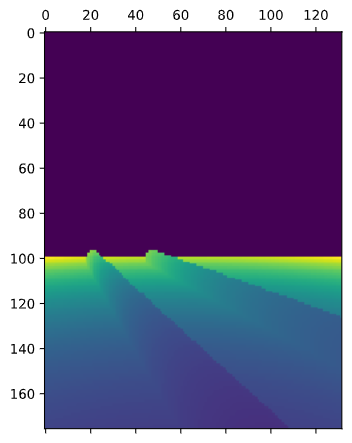
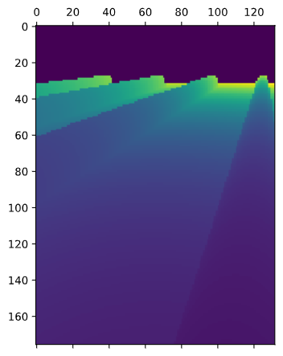
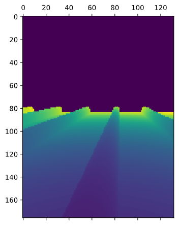

# Simulated Crop Row Datset
<div style="text-align:center">



<br/>Depth maps 260, 261 and 262 of the dataset
</div>

This is a dataset containing 2720 depth maps for simulated strawberry crop rows. Strawberry crop rows are known for being covered by plastic in cylindrical shapes.

It is useful for navigation purposes to identify the angle of the crop rows.

## Dataset structure
Each text file contains a string of 23232 (132 x 176) integers between 0 and 7000. The data is rotated anticlockwise by 90 degrees and needs to be rotated by 90 degrees clockwise.

| Camera parameter | Value                             |
|------------------|-----------------------------------|
| FOVWidth         | 45 degrees                        |
| FOVHeight        | 30 degrees                        |
| Image resolution | 132 x 176 pixels (Height x Width) |
| Maximum depth    | 7000                              |

`details.log` contains a list of labels. Each line is structured as follows (in degrees, metres)
```
<id> <angle of crop rows> <camera x rotation> <camera y rotation> <camera z rotation> <camera x position> <camera y position> <camera z position>
````

`predictions.log` contains a list of predictions from Hough Transform and RANSAC algorithms. Lines are structured as follows.
```
<id> Real: <real angle of crop rows>
<id> Hough: <list of predicted angles from Hough Transform>
<id> RANSAC: <list of predicted angles from RANSAC>
```